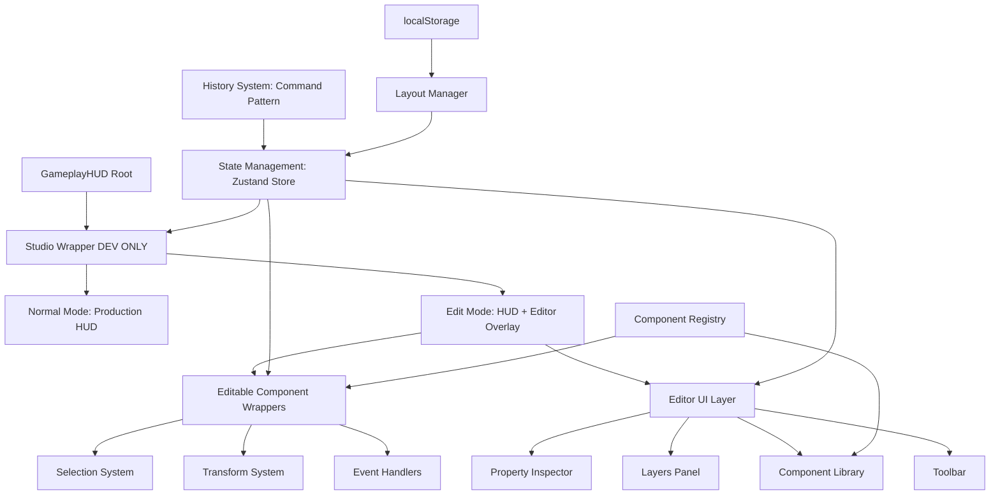

# HUD Studio - Design Document

## Executive Summary

The HUD Studio is a visual editor that transforms the gameplay HUD into an editable canvas, enabling designers and developers to manipulate, configure, and export HUD layouts through an intuitive drag-and-drop interface. This document details the technical architecture, component design, state management, data flow, and implementation specifications required to build a production-ready visual editor.

**Key Design Principles:**
- **Non-invasive**: Edit mode overlay that doesn't modify production HUD code
- **Performance-first**: 60 FPS interactions with GPU-accelerated transforms
- **Responsive-native**: Normalized positioning system for cross-device layouts
- **Developer-friendly**: Minimal registration API for new components
- **Type-safe**: Full TypeScript coverage with strict type checking

---

## Overview

### System Architecture

The HUD Studio operates as a development-only overlay system that wraps the existing GameplayHUD component tree. It consists of four primary layers:



**Layer Responsibilities:**

1. **Studio Wrapper Layer**: Environment detection, mode toggle, conditional rendering
2. **Component Wrapper Layer**: Selection detection, drag/resize handlers, transform application
3. **Editor UI Layer**: Panels, toolbars, inspectors (floating React portals)
4. **State Management Layer**: Centralized Zustand store for all editor state
5. **Persistence Layer**: localStorage for layouts, settings, history

### Technology Stack

**Core Technologies:**
- **Framework**: Next.js 14+ (App Router), React 18+
- **State Management**: Zustand (lightweight, no providers, TypeScript-first)
- **Animations**: Framer Motion (already integrated)
- **Styling**: CSS Modules + CSS Variables (matches existing system)
- **Type Safety**: TypeScript 5+ with strict mode
- **Storage**: Browser localStorage API

**Why Zustand over Context API:**
- No provider wrapper hell
- Better TypeScript inference
- Built-in middleware support (persist, devtools)
- Minimal re-renders (selector-based subscriptions)
- Simpler testing (no mock providers)

---

## Architecture

### Component Hierarchy

```
src/components/gameplay/hud-studio/
├── index.ts                          # Public API exports
├── HUDStudioProvider.tsx             # Root wrapper (dev-only HOC)
├── HUDStudioContext.tsx              # Environment detection
│
├── core/
│   ├── EditModeWrapper.tsx           # Mode toggle + conditional rendering
│   ├── EditableComponent.tsx         # Wraps each HUD component
│   ├── SelectionOverlay.tsx          # Selection outline + handles
│   ├── DragController.tsx            # Drag behavior logic
│   ├── ResizeController.tsx          # Resize behavior logic
│   └── TransformEngine.ts            # GPU-accelerated transform utilities
│
├── panels/
│   ├── PropertyInspector/
│   │   ├── index.tsx                 # Main inspector panel
│   │   ├── PropertyGroup.tsx         # Collapsible property sections
│   │   ├── inputs/
│   │   │   ├── NumberInput.tsx       # Number with +/- buttons
│   │   │   ├── SliderInput.tsx       # Range slider
│   │   │   ├── ColorInput.tsx        # Color picker
│   │   │   ├── ToggleInput.tsx       # Boolean toggle
│   │   │   └── SelectInput.tsx       # Dropdown
│   │   └── properties/
│   │       ├── PositionProperties.tsx
│   │       ├── SizeProperties.tsx
│   │       ├── StyleProperties.tsx
│   │       └── LayoutProperties.tsx
│   │
│   ├── LayersPanel/
│   │   ├── index.tsx                 # Layers list
│   │   ├── LayerItem.tsx             # Single layer row
│   │   ├── LayerActions.tsx          # Lock/visibility/delete
│   │   └── LayerDragHandle.tsx       # Reorder drag handle
│   │
│   ├── ComponentLibrary/
│   │   ├── index.tsx                 # Library panel
│   │   ├── CategorySection.tsx       # Collapsible category
│   │   ├── ComponentCard.tsx         # Draggable component card
│   │   └── ComponentSearch.tsx       # Filter/search
│   │
│   ├── Toolbar/
│   │   ├── index.tsx                 # Main toolbar
│   │   ├── AlignmentTools.tsx        # Align/distribute buttons
│   │   ├── SnapControls.tsx          # Snap toggles + grid size
│   │   ├── ViewportSelector.tsx      # Device preset dropdown
│   │   ├── DataModeToggle.tsx        # Mock vs Live data
│   │   └── HistoryControls.tsx       # Undo/redo buttons
│   │
│   └── ValidationPanel/
│       ├── index.tsx                 # Validation results
│       ├── IssueItem.tsx             # Single issue row
│       └── AutoFixButton.tsx         # Auto-fix action
│
├── systems/
│   ├── registry/
│   │   ├── ComponentRegistry.ts      # Component registration
│   │   ├── types.ts                  # Registry type definitions
│   │   └── defaults.ts               # Default component configs
│   │
│   ├── state/
│   │   ├── store.ts                  # Main Zustand store
│   │   ├── slices/
│   │   │   ├── editorSlice.ts        # Editor state (mode, selected)
│   │   │   ├── componentsSlice.ts    # Component positions/props
│   │   │   ├── historySlice.ts       # Undo/redo state
│   │   │   ├── layoutSlice.ts        # Layout management
│   │   │   └── validationSlice.ts    # Validation results
│   │   └── middleware/
│   │       ├── persistence.ts        # localStorage sync
│   │       └── history.ts            # History tracking
│   │
│   ├── history/
│   │   ├── CommandHistory.ts         # Command pattern implementation
│   │   ├── commands/
│   │   │   ├── MoveCommand.ts
│   │   │   ├── ResizeCommand.ts
│   │   │   ├── PropertyCommand.ts
│   │   │   ├── AddCommand.ts
│   │   │   ├── DeleteCommand.ts
│   │   │   └── BatchCommand.ts
│   │   └── types.ts
│   │
│   ├── layout/
│   │   ├── LayoutManager.ts          # Save/load/export layouts
│   │   ├── normalizer.ts             # Pixel ↔ normalized conversion
│   │   ├── exporter.ts               # JSON/code generation
│   │   ├── importer.ts               # JSON import + validation
│   │   └── presets.ts                # Default layout presets
│   │
│   ├── validation/
│   │   ├── Validator.ts              # Main validation engine
│   │   ├── rules/
│   │   │   ├── overlapRule.ts
│   │   │   ├── safeAreaRule.ts
│   │   │   ├── touchTargetRule.ts
│   │   │   ├── offscreenRule.ts
│   │   │   └── index.ts
│   │   └── types.ts
│   │
│   ├── snap/
│   │   ├── SnapEngine.ts             # Snap detection
│   │   ├── GridSnap.ts               # Grid snapping
│   │   ├── EdgeSnap.ts               # Component edge snapping
│   │   ├── CenterGuides.ts           # Center guide rendering
│   │   └── types.ts
│   │
│   └── alignment/
│       ├── AlignmentEngine.ts        # Alignment operations
│       ├── operations.ts             # Align/distribute logic
│       └── types.ts
│
├── utils/
│   ├── transforms.ts                 # Transform calculations
│   ├── geometry.ts                   # Bounding box, overlap detection
│   ├── device-presets.ts             # Device viewport definitions
│   ├── safe-areas.ts                 # Safe area calculations
│   └── performance.ts                # RAF throttling, GPU detection
│
├── hooks/
│   ├── useEditorState.ts             # Editor state selectors
│   ├── useSelection.ts               # Selection management
│   ├── useDragDrop.ts                # Drag & drop behavior
│   ├── useResize.ts                  # Resize behavior
│   ├── useKeyboard.ts                # Keyboard shortcuts
│   ├── useHistory.ts                 # Undo/redo hooks
│   └── useValidation.ts              # Validation hooks
│
└── styles/
    ├── editor.module.css             # Editor UI styles
    ├── panels.module.css             # Panel styles
    ├── overlays.module.css           # Selection/guide overlays
    └── variables.css                 # CSS custom properties

---

## Core Systems Design

### 1. Component Registration System

The Component Registry is the foundation for extensibility. Every HUD component must register itself to become editable.

**Registration API:**

```typescript
// src/components/gameplay/hud-studio/systems/registry/types.ts

export interface HUDComponentMetadata {
  id: string;                          // Unique identifier (e.g., "wheel", "top-hud")
  displayName: string;                 // Human-readable name
  category: ComponentCategory;         // Library categorization
  component: React.ComponentType<any>; // The actual React component
  defaultProps: Record<string, any>;   // Default props
  editableProps: EditableProp[];       // Which props are editable
  constraints: ComponentConstraints;   // Min/max size, aspect ratio
  states?: ComponentState[];           // Available preview states
  icon?: string;                       // Library icon
}

export type ComponentCategory = 
  | 'core-hud'
  | 'gameplay'
  | 'combat'
  | 'social'
  | 'voice'
  | 'economy'
  | 'progression'
  | 'effects'
  | 'developer';

export interface EditableProp {
  key: string;                         // Prop name
  label: string;                       // Inspector label
  type: PropType;                      // Input type
  defaultValue: any;
  min?: number;
  max?: number;
  step?: number;
  options?: Array<{ label: string; value: any }>;
}

export type PropType =
  | 'number'
  | 'string'
  | 'boolean'
  | 'color'
  | 'select'
  | 'slider'
  | 'range';

export interface ComponentConstraints {
  minWidth?: number;                   // Minimum width (normalized)
  minHeight?: number;
  maxWidth?: number;
  maxHeight?: number;
  maintainAspectRatio?: boolean;
  lockPosition?: boolean;              // Can't be moved
  lockSize?: boolean;                  // Can't be resized
}

export interface ComponentState {
  id: string;
  label: string;
  props: Record<string, any>;          // Props override for this state
}
```

**Registration Function:**

```typescript
// src/components/gameplay/hud-studio/systems/registry/ComponentRegistry.ts

class ComponentRegistry {
  private components = new Map<string, HUDComponentMetadata>();

  register(metadata: HUDComponentMetadata): void {
    if (this.components.has(metadata.id)) {
      console.warn(`Component ${metadata.id} already registered`);
      return;
    }
    this.components.set(metadata.id, metadata);
  }

  unregister(id: string): void {
    this.components.delete(id);
  }

  get(id: string): HUDComponentMetadata | undefined {
    return this.components.get(id);
  }

  getAll(): HUDComponentMetadata[] {
    return Array.from(this.components.values());
  }

  getByCategory(category: ComponentCategory): HUDComponentMetadata[] {
    return this.getAll().filter(c => c.category === category);
  }
}

export const componentRegistry = new ComponentRegistry();
```

**Example Registration:**

```typescript
// src/components/gameplay/hud/WheelHUD.tsx

import { componentRegistry } from '@/components/gameplay/hud-studio';

// Register on module load (only in dev)
if (process.env.NODE_ENV === 'development') {
  componentRegistry.register({
    id: 'wheel',
    displayName: 'Gameplay Wheel',
    category: 'gameplay',
    component: WheelHUD,
    defaultProps: {
      isSpinning: false,
      outcome: null,
    },
    editableProps: [
      {
        key: 'scale',
        label: 'Scale',
        type: 'slider',
        defaultValue: 1.0,
        min: 0.5,
        max: 2.0,
        step: 0.1,
      },
    ],
    constraints: {
      minWidth: 0.4,
      minHeight: 0.3,
      maintainAspectRatio: true,
    },
    states: [
      { id: 'idle', label: 'Idle', props: { isSpinning: false } },
      { id: 'spinning', label: 'Spinning', props: { isSpinning: true } },
    ],
  });
}
```

---

### 2. State Management (Zustand)

**Store Structure:**

```typescript
// src/components/gameplay/hud-studio/systems/state/store.ts

import { create } from 'zustand';
import { devtools, persist } from 'zustand/middleware';
import { editorSlice, EditorSlice } from './slices/editorSlice';
import { componentsSlice, ComponentsSlice } from './slices/componentsSlice';
import { historySlice, HistorySlice } from './slices/historySlice';
import { layoutSlice, LayoutSlice } from './slices/layoutSlice';
import { validationSlice, ValidationSlice } from './slices/validationSlice';

export type StudioStore = 
  & EditorSlice
  & ComponentsSlice
  & HistorySlice
  & LayoutSlice
  & ValidationSlice;

export const useStudioStore = create<StudioStore>()(
  devtools(
    persist(
      (...args) => ({
        ...editorSlice(...args),
        ...componentsSlice(...args),
        ...historySlice(...args),
        ...layoutSlice(...args),
        ...validationSlice(...args),
      }),
      {
        name: 'hud-studio-storage',
        partialize: (state) => ({
          // Only persist these
          layouts: state.layouts,
          currentLayoutId: state.currentLayoutId,
          editorSettings: state.editorSettings,
        }),
      }
    ),
    { name: 'HUDStudio' }
  )
);
```

**Editor Slice:**

```typescript
// src/components/gameplay/hud-studio/systems/state/slices/editorSlice.ts

export interface EditorSlice {
  // Mode
  isEditMode: boolean;
  toggleEditMode: () => void;
  setEditMode: (enabled: boolean) => void;

  // Selection
  selectedComponentId: string | null;
  selectComponent: (id: string | null) => void;

  // Viewport
  viewport: ViewportConfig;
  setViewport: (viewport: ViewportConfig) => void;

  // Panels
  panels: {
    inspector: boolean;
    layers: boolean;
    library: boolean;
    validation: boolean;
  };
  togglePanel: (panel: keyof EditorSlice['panels']) => void;

  // Settings
  editorSettings: EditorSettings;
  updateSettings: (settings: Partial<EditorSettings>) => void;
}

export interface ViewportConfig {
  width: number;
  height: number;
  scale: number;
  deviceName: string;
}

export interface EditorSettings {
  snapEnabled: boolean;
  snapToGrid: boolean;
  snapToComponents: boolean;
  snapToSafeArea: boolean;
  gridSize: number;
  showSafeAreas: boolean;
  showGrid: boolean;
  showRulers: boolean;
  dataMode: 'mock' | 'live';
}

export const editorSlice: StateCreator<StudioStore, [], [], EditorSlice> = (set) => ({
  isEditMode: false,
  toggleEditMode: () => set((state) => ({ isEditMode: !state.isEditMode })),
  setEditMode: (enabled) => set({ isEditMode: enabled }),

  selectedComponentId: null,
  selectComponent: (id) => set({ selectedComponentId: id }),

  viewport: {
    width: 390,
    height: 844,
    scale: 1,
    deviceName: 'iPhone 16',
  },
  setViewport: (viewport) => set({ viewport }),

  panels: {
    inspector: true,
    layers: true,
    library: false,
    validation: false,
  },
  togglePanel: (panel) => set((state) => ({
    panels: { ...state.panels, [panel]: !state.panels[panel] },
  })),

  editorSettings: {
    snapEnabled: true,
    snapToGrid: true,
    snapToComponents: true,
    snapToSafeArea: true,
    gridSize: 8,
    showSafeAreas: false,
    showGrid: false,
    showRulers: false,
    dataMode: 'mock',
  },
  updateSettings: (settings) => set((state) => ({
    editorSettings: { ...state.editorSettings, ...settings },
  })),
});
```

**Components Slice:**

```typescript
// src/components/gameplay/hud-studio/systems/state/slices/componentsSlice.ts

export interface ComponentsSlice {
  components: Record<string, ComponentInstance>;
  addComponent: (component: ComponentInstance) => void;
  removeComponent: (id: string) => void;
  updateComponent: (id: string, updates: Partial<ComponentInstance>) => void;
  duplicateComponent: (id: string) => void;
  reorderComponent: (id: string, newZIndex: number) => void;
}

export interface ComponentInstance {
  id: string;                    // Instance ID (unique per layout)
  componentId: string;            // Registry ID (e.g., "wheel")
  position: NormalizedPosition;
  size: NormalizedSize;
  zIndex: number;
  visible: boolean;
  locked: boolean;
  opacity: number;
  props: Record<string, any>;    // Component-specific props
  styleOverrides: StyleOverrides;
}

export interface NormalizedPosition {
  x: number;  // 0.0 - 1.0
  y: number;  // 0.0 - 1.0
}

export interface NormalizedSize {
  width: number;   // 0.0 - 1.0
  height: number;  // 0.0 - 1.0
}

export interface StyleOverrides {
  borderRadius?: number;
  blur?: number;
  borderWidth?: number;
  borderColor?: string;
  shadow?: 'none' | 'small' | 'medium' | 'large';
  padding?: { horizontal: number; vertical: number };
  margin?: { horizontal: number; vertical: number };
  scale?: number;
}

export const componentsSlice: StateCreator<StudioStore, [], [], ComponentsSlice> = (set) => ({
  components: {},
  
  addComponent: (component) => set((state) => ({
    components: { ...state.components, [component.id]: component },
  })),

  removeComponent: (id) => set((state) => {
    const { [id]: removed, ...rest } = state.components;
    return { components: rest };
  }),

  updateComponent: (id, updates) => set((state) => ({
    components: {
      ...state.components,
      [id]: { ...state.components[id], ...updates },
    },
  })),

  duplicateComponent: (id) => set((state) => {
    const original = state.components[id];
    if (!original) return state;

    const newId = `${original.componentId}-${Date.now()}`;
    const duplicate: ComponentInstance = {
      ...original,
      id: newId,
      position: {
        x: original.position.x + 0.02,
        y: original.position.y + 0.02,
      },
    };

    return {
      components: { ...state.components, [newId]: duplicate },
    };
  }),

  reorderComponent: (id, newZIndex) => set((state) => {
    const component = state.components[id];
    if (!component) return state;

    return {
      components: {
        ...state.components,
        [id]: { ...component, zIndex: newZIndex },
      },
    };
  }),
});
```

---

### 3. History System (Command Pattern)

**Command Interface:**

```typescript
// src/components/gameplay/hud-studio/systems/history/types.ts

export interface Command {
  execute(): void;
  undo(): void;
  description: string;
}
```

**Command History Manager:**

```typescript
// src/components/gameplay/hud-studio/systems/history/CommandHistory.ts

export class CommandHistory {
  private undoStack: Command[] = [];
  private redoStack: Command[] = [];
  private maxSize = 100;

  execute(command: Command): void {
    command.execute();
    this.undoStack.push(command);
    this.redoStack = []; // Clear redo on new action
    
    if (this.undoStack.length > this.maxSize) {
      this.undoStack.shift();
    }
  }

  undo(): void {
    const command = this.undoStack.pop();
    if (command) {
      command.undo();
      this.redoStack.push(command);
    }
  }

  redo(): void {
    const command = this.redoStack.pop();
    if (command) {
      command.execute();
      this.undoStack.push(command);
    }
  }

  canUndo(): boolean {
    return this.undoStack.length > 0;
  }

  canRedo(): boolean {
    return this.redoStack.length > 0;
  }

  clear(): void {
    this.undoStack = [];
    this.redoStack = [];
  }

  getHistory(): Command[] {
    return [...this.undoStack];
  }
}

export const commandHistory = new CommandHistory();
```

**Example Commands:**

```typescript
// src/components/gameplay/hud-studio/systems/history/commands/MoveCommand.ts

export class MoveCommand implements Command {
  description: string;
  
  constructor(
    private componentId: string,
    private oldPosition: NormalizedPosition,
    private newPosition: NormalizedPosition,
    private updateFn: (id: string, pos: NormalizedPosition) => void
  ) {
    this.description = `Move ${componentId}`;
  }

  execute(): void {
    this.updateFn(this.componentId, this.newPosition);
  }

  undo(): void {
    this.updateFn(this.componentId, this.oldPosition);
  }
}

// src/components/gameplay/hud-studio/systems/history/commands/PropertyCommand.ts

export class PropertyCommand implements Command {
  description: string;

  constructor(
    private componentId: string,
    private property: string,
    private oldValue: any,
    private newValue: any,
    private updateFn: (id: string, prop: string, value: any) => void
  ) {
    this.description = `Change ${property} of ${componentId}`;
  }

  execute(): void {
    this.updateFn(this.componentId, this.property, this.newValue);
  }

  undo(): void {
    this.updateFn(this.componentId, this.property, this.oldValue);
  }
}
```

---

### 4. Normalized Layout System

**Conversion Utilities:**

```typescript
// src/components/gameplay/hud-studio/systems/layout/normalizer.ts

export interface CanvasSize {
  width: number;
  height: number;
}

export function pixelsToNormalized(
  pixels: { x: number; y: number; width: number; height: number },
  canvas: CanvasSize
): { x: number; y: number; width: number; height: number } {
  return {
    x: pixels.x / canvas.width,
    y: pixels.y / canvas.height,
    width: pixels.width / canvas.width,
    height: pixels.height / canvas.height,
  };
}

export function normalizedToPixels(
  normalized: { x: number; y: number; width: number; height: number },
  canvas: CanvasSize
): { x: number; y: number; width: number; height: number } {
  return {
    x: normalized.x * canvas.width,
    y: normalized.y * canvas.height,
    width: normalized.width * canvas.width,
    height: normalized.height * canvas.height,
  };
}

export function clampNormalized(value: number): number {
  return Math.max(0, Math.min(1, value));
}

export function roundNormalized(value: number, precision = 4): number {
  const multiplier = Math.pow(10, precision);
  return Math.round(value * multiplier) / multiplier;
}
```

---

### 5. Drag & Drop System

**Drag Hook:**

```typescript
// src/components/gameplay/hud-studio/hooks/useDragDrop.ts

export function useDragDrop(componentId: string) {
  const { components, updateComponent, editorSettings, viewport } = useStudioStore();
  const [isDragging, setIsDragging] = useState(false);
  const dragStartPos = useRef<{ x: number; y: number } | null>(null);
  const componentStartPos = useRef<NormalizedPosition | null>(null);

  const handleDragStart = useCallback((e: React.MouseEvent | React.TouchEvent) => {
    const component = components[componentId];
    if (!component || component.locked) return;

    setIsDragging(true);
    
    const clientX = 'touches' in e ? e.touches[0].clientX : e.clientX;
    const clientY = 'touches' in e ? e.touches[0].clientY : e.clientY;

    dragStartPos.current = { x: clientX, y: clientY };
    componentStartPos.current = component.position;

    e.preventDefault();
    e.stopPropagation();
  }, [componentId, components]);

  const handleDragMove = useCallback((e: MouseEvent | TouchEvent) => {
    if (!isDragging || !dragStartPos.current || !componentStartPos.current) return;

    const clientX = 'touches' in e ? e.touches[0].clientX : e.clientX;
    const clientY = 'touches' in e ? e.touches[0].clientY : e.clientY;

    const deltaX = clientX - dragStartPos.current.x;
    const deltaY = clientY - dragStartPos.current.y;

    // Convert pixel delta to normalized delta
    const normalizedDeltaX = deltaX / viewport.width;
    const normalizedDeltaY = deltaY / viewport.height;

    let newX = componentStartPos.current.x + normalizedDeltaX;
    let newY = componentStartPos.current.y + normalizedDeltaY;

    // Apply snapping
    if (editorSettings.snapEnabled) {
      const snapped = applySnapping(
        { x: newX, y: newY },
        componentId,
        components,
        editorSettings
      );
      newX = snapped.x;
      newY = snapped.y;
    }

    // Clamp to canvas bounds
    newX = clampNormalized(newX);
    newY = clampNormalized(newY);

    // Use GPU-accelerated transform during drag (don't update state yet)
    requestAnimationFrame(() => {
      updateComponent(componentId, {
        position: { x: newX, y: newY },
      });
    });
  }, [isDragging, componentId, components, editorSettings, viewport, updateComponent]);

  const handleDragEnd = useCallback(() => {
    if (isDragging) {
      setIsDragging(false);
      
      // Create history command
      if (componentStartPos.current && dragStartPos.current) {
        const component = components[componentId];
        const command = new MoveCommand(
          componentId,
          componentStartPos.current,
          component.position,
          (id, pos) => updateComponent(id, { position: pos })
        );
        commandHistory.execute(command);
      }

      dragStartPos.current = null;
      componentStartPos.current = null;
    }
  }, [isDragging, componentId, components, updateComponent]);

  // Attach/detach listeners
  useEffect(() => {
    if (isDragging) {
      window.addEventListener('mousemove', handleDragMove);
      window.addEventListener('touchmove', handleDragMove);
      window.addEventListener('mouseup', handleDragEnd);
      window.addEventListener('touchend', handleDragEnd);

      return () => {
        window.removeEventListener('mousemove', handleDragMove);
        window.removeEventListener('touchmove', handleDragMove);
        window.removeEventListener('mouseup', handleDragEnd);
        window.removeEventListener('touchend', handleDragEnd);
      };
    }
  }, [isDragging, handleDragMove, handleDragEnd]);

  return {
    isDragging,
    handleDragStart,
  };
}
```

---

### 6. Transform Engine (GPU-Accelerated)

```typescript
// src/components/gameplay/hud-studio/core/TransformEngine.ts

export function applyTransform(
  element: HTMLElement,
  position: NormalizedPosition,
  size: NormalizedSize,
  canvasSize: CanvasSize,
  options: {
    scale?: number;
    opacity?: number;
  } = {}
): void {
  const pixels = normalizedToPixels(
    { x: position.x, y: position.y, width: size.width, height: size.height },
    canvasSize
  );

  // Use translate3d for GPU acceleration
  element.style.transform = `translate3d(${pixels.x}px, ${pixels.y}px, 0) scale(${options.scale ?? 1})`;
  element.style.width = `${pixels.width}px`;
  element.style.height = `${pixels.height}px`;
  
  if (options.opacity !== undefined) {
    element.style.opacity = options.opacity.toString();
  }

  // Force GPU layer
  element.style.willChange = 'transform';
}

export function removeTransform(element: HTMLElement): void {
  element.style.transform = '';
  element.style.willChange = 'auto';
}
```

---

## Data Flow

### Component Editing Flow

```
User Action (drag/resize/property change)
  ↓
Event Handler (useDragDrop, useResize, PropertyInput)
  ↓
Create Command (MoveCommand, ResizeCommand, PropertyCommand)
  ↓
Execute Command → Update Zustand Store
  ↓
Zustand Notifies Subscribers (via selectors)
  ↓
EditableComponent re-renders
  ↓
Transform Applied (GPU-accelerated)
  ↓
Validation Check (triggered on debounce)
  ↓
Update Validation Panel
```

### Layout Save/Load Flow

```
User clicks "Save Layout"
  ↓
LayoutManager.save()
  ↓
Extract current state from Zustand
  ↓
Convert to normalized JSON
  ↓
Validate structure
  ↓
Save to localStorage
  ↓
Update layout list

User clicks "Load Layout"
  ↓
LayoutManager.load(id)
  ↓
Read from localStorage
  ↓
Parse JSON
  ↓
Validate structure
  ↓
Update Zustand store
  ↓
Components re-render
```

### Export Flow

```
User clicks "Export"
  ↓
Exporter.generate()
  ↓
Read current layout from store
  ↓
Run validation
  ↓
Generate JSON configuration
  ↓
(Optional) Generate TypeScript types
  ↓
(Optional) Generate CSS variables
  ↓
Download as file or copy to clipboard
```

---

## API Specifications

### Component Registration API

```typescript
// Minimal registration for new components

componentRegistry.register({
  id: 'my-widget',
  displayName: 'My Widget',
  category: 'developer',
  component: MyWidget,
  defaultProps: { value: 0 },
  editableProps: [
    { key: 'value', label: 'Value', type: 'number', defaultValue: 0 },
  ],
  constraints: {
    minWidth: 0.1,
    minHeight: 0.05,
  },
});
```

### Store Hook API

```typescript
// Selector-based access (minimizes re-renders)

const isEditMode = useStudioStore(state => state.isEditMode);
const selectedId = useStudioStore(state => state.selectedComponentId);
const component = useStudioStore(state => state.components[id]);

// Actions
const { selectComponent, updateComponent, toggleEditMode } = useStudioStore();
```

### History API

```typescript
import { commandHistory } from '@/components/gameplay/hud-studio';

// Execute command (auto-adds to history)
commandHistory.execute(new MoveCommand(...));

// Undo/redo
commandHistory.undo();
commandHistory.redo();

// Check state
const canUndo = commandHistory.canUndo();
const canRedo = commandHistory.canRedo();
```

### Layout Manager API

```typescript
import { layoutManager } from '@/components/gameplay/hud-studio';

// Save current layout
const layoutId = await layoutManager.save('My Layout');

// Load layout
await layoutManager.load(layoutId);

// Export as JSON
const json = layoutManager.exportJSON();

// Import from JSON
await layoutManager.importJSON(json);

// Get all layouts
const layouts = layoutManager.getAll();
```

---

## Implementation Phases

### Phase 1: Foundation (Week 1-2)
- Component Registry system
- Zustand store setup with slices
- Environment detection (dev-only)
- HUDStudioProvider wrapper
- Edit mode toggle

### Phase 2: Core Editing (Week 3-4)
- EditableComponent wrapper
- Selection system
- Drag & drop (mouse + touch)
- Resize system
- Transform engine (GPU-accelerated)

### Phase 3: UI Panels (Week 5-6)
- Property Inspector with inputs
- Layers Panel with reordering
- Toolbar with alignment tools
- Component Library

### Phase 4: Systems (Week 7-8)
- History system (undo/redo)
- Snap system (grid, edges, components)
- Validation system
- Safe area guides

### Phase 5: Layout Management (Week 9-10)
- Layout save/load
- Normalized position conversion
- Import/Export system
- Preset layouts

### Phase 6: Polish & Testing (Week 11-12)
- Responsive preview with device presets
- Live data preview mode
- Component state preview
- Performance optimization
- Keyboard shortcuts
- Documentation

---

## Performance Considerations

### Optimization Strategies

1. **GPU Acceleration**
   - Use `translate3d` for all positioning
   - Apply `will-change: transform` during interactions
   - Remove after interaction completes

2. **Render Optimization**
   - Zustand selectors to prevent unnecessary re-renders
   - `React.memo` on all panel components
   - Virtual scrolling for long lists (layers, library)
   - Throttle/debounce property updates

3. **State Updates**
   - Batch updates during drag (use RAF)
   - Commit to store only on drag/resize end
   - Use immer for immutable updates (via Zustand)

4. **Event Handling**
   - Passive event listeners where possible
   - Use event delegation for repeated elements
   - Cleanup listeners on unmount

5. **Memory Management**
   - Limit history to 100 entries
   - Clear unused layout data
   - Lazy-load panel content
   - Use IntersectionObserver for component visibility

---

## Security & Environment Gating

### Development-Only Access

```typescript
// src/components/gameplay/hud-studio/HUDStudioContext.tsx

export function HUDStudioProvider({ children }: { children: React.ReactNode }) {
  // Only load in development
  if (process.env.NODE_ENV !== 'development') {
    return <>{children}</>;
  }

  return (
    <HUDStudioWrapper>
      {children}
    </HUDStudioWrapper>
  );
}
```

### Environment Variables

```env
# .env.local
NEXT_PUBLIC_ENABLE_HUD_STUDIO=true
```

### Build Configuration

```typescript
// next.config.ts
const config = {
  webpack: (config, { dev }) => {
    if (!dev) {
      // Strip HUD Studio code in production
      config.plugins.push(
        new webpack.NormalModuleReplacementPlugin(
          /hud-studio/,
          path.resolve(__dirname, 'src/components/gameplay/hud-studio/noop.ts')
        )
      );
    }
    return config;
  },
};
```

---

## Testing Strategy

### Unit Tests
- Component Registry registration/retrieval
- Normalized position conversion
- Command execution/undo/redo
- Validation rules
- Snap calculations

### Integration Tests
- Drag & drop workflow
- Resize workflow
- Property editing workflow
- Layout save/load
- Import/export

### E2E Tests (Playwright)
- Complete editing session
- Multi-component manipulation
- Undo/redo scenarios
- Cross-device preview
- Export and re-import

---

## Success Metrics

- **Performance**: Maintain 60 FPS during all interactions
- **Load Time**: Studio overlay loads in < 500ms
- **Memory**: < 50MB memory footprint
- **Usability**: Designer can create layout in < 10 minutes
- **Extensibility**: New component registration < 10 lines of code
- **Export Size**: JSON layout < 10KB

---

*Document Version: 1.0*  
*Last Updated: 2025-01-15*  
*Status: Ready for Implementation*  
*Next Step: Create tasks.md with implementation breakdown*
