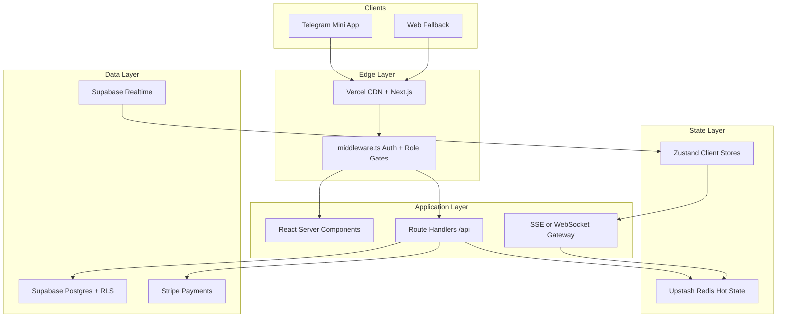
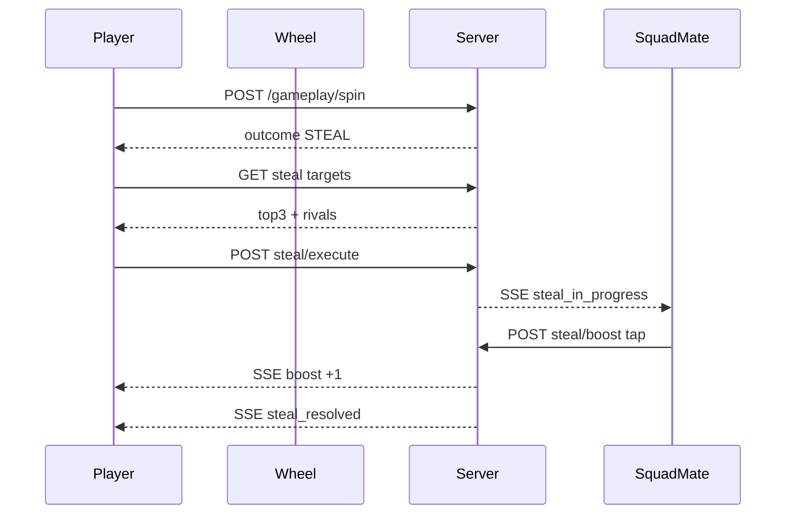

# THE PHANTOM — Full Project Execution Plan

## Current State Audit

| Area | Status |
|------|--------|
| Source code | **None** — only 3 spec files in [`About this project/`](About this project/) |
| `package.json` / Next.js | Not started |
| Supabase schema | Not started (credentials provided; **rotate keys** — they were shared in chat) |
| Redis (Upstash) | Not started |
| Implementation progress | **0%** — specification phase complete |

**Product:** THE PHANTOM is a living competitive ecosystem centered on 20-minute cash-entry sessions with token-based spin gameplay, squads, camps, rivalries, and a three-economy shop. Sessions are the engine; everything else supports retention and scale.

**Your locked decisions (override spec contradictions):**

| Topic | Authoritative rule |
|-------|-------------------|
| Phase 1 thresholds | Model A: 38+ advance, 35–37.5 revivable, &lt;35 eliminated — **admin-configurable per session for all phases** |
| Steal | Player-initiated; system shows **top 3 token leaders + rivals**; base 1 token; squad **Fire Boost** UI (tap up to 5×, fills container, each fill +1 steal) |
| Cloak | **Full exclusion** from steal target list for duration (Shop §11.3) |
| Registration lock | **Fixed 10 min** before session start |
| Platform | **Telegram Mini App first**; no `initData` → Google OAuth signup |
| Bot protection | **reCAPTCHA** before registration, verified server-side and stored in DB |
| Payments | **Stripe** (wallet balance + entry fees + shop) |
| MVP1 scope | **Full player experience** — defer Admin UI and Camp Owner dashboards to MVP2 |

---

## Target Architecture (Scale to Millions)



**Scaling principles:**
- **Hot path in Redis:** active sub-session state (tokens, spins, phase timers, steal-in-progress, fire-boost counters) — sub-100ms reads/writes at 100 players × N sub-sessions
- **Cold path in Postgres:** identities, economy ledger, session history, audit logs — immutable append-only financial records
- **Stateless Next.js** on Vercel; horizontal scale via serverless + connection pooling (Supabase Supavisor)
- **Sub-session sharding:** max 100 players per sub-session (spec §9.5); matchmaking service assigns squads atomically
- **Event sourcing for gameplay:** every spin/steal/revive → `session_events` table + Redis pub/sub for realtime UI
- **Idempotent Stripe webhooks** for wallet credits/debits

---

## Repository File Structure

```
ThePhantomNetwork/
├── project-plan.md                 # Living progress doc (created on approval)
├── README.md
├── .env.example                    # NO secrets committed
├── package.json
├── next.config.ts
├── tsconfig.json
├── tailwind.config.ts
├── middleware.ts
│
├── supabase/
│   ├── migrations/                 # Ordered SQL migrations
│   ├── seed.sql                    # Default camp, avatars, admin config
│   └── config.toml
│
├── src/
│   ├── app/
│   │   ├── layout.tsx              # Dark theme shell, fonts, providers
│   │   ├── page.tsx                # Entry / redirect
│   │   ├── (auth)/
│   │   │   ├── login/page.tsx      # Telegram + Google + reCAPTCHA
│   │   │   └── onboarding/page.tsx # Avatar + camp assignment
│   │   ├── (player)/
│   │   │   ├── layout.tsx          # Nav, live-world ticker
│   │   │   ├── home/page.tsx
│   │   │   ├── profile/
│   │   │   │   ├── page.tsx
│   │   │   │   ├── tokens/page.tsx
│   │   │   │   └── sessions/page.tsx
│   │   │   ├── camps/
│   │   │   │   ├── page.tsx
│   │   │   │   └── [campId]/page.tsx
│   │   │   ├── squads/
│   │   │   │   ├── page.tsx
│   │   │   │   └── [squadId]/page.tsx
│   │   │   ├── sessions/
│   │   │   │   ├── page.tsx
│   │   │   │   └── [sessionId]/page.tsx
│   │   │   ├── play/[sessionId]/page.tsx   # Live gameplay shell
│   │   │   ├── shop/page.tsx
│   │   │   ├── rivals/page.tsx
│   │   │   └── social/page.tsx
│   │   └── api/
│   │       ├── auth/               # telegram, google, captcha-verify
│   │       ├── profile/
│   │       ├── camps/
│   │       ├── squads/
│   │       ├── sessions/
│   │       ├── gameplay/           # spin, steal, revive, amplify
│   │       ├── shop/
│   │       ├── wallet/
│   │       ├── stripe/webhook/
│   │       └── realtime/[subSessionId]/route.ts  # SSE stream
│   │
│   ├── components/
│   │   ├── ui/                     # Button, Modal, Badge, Card
│   │   ├── layout/                 # NavBar, LiveFeed, PhaseTimer
│   │   ├── gameplay/
│   │   │   ├── SpinWheel.tsx       # Framer Motion 8s animation
│   │   │   ├── StealTargetPicker.tsx
│   │   │   ├── FireBoostMeter.tsx  # Squad fire tap UI
│   │   │   ├── RevivePanel.tsx
│   │   │   └── PhaseTransition.tsx
│   │   ├── session/
│   │   ├── shop/
│   │   ├── squad/
│   │   └── camp/
│   │
│   ├── stores/                     # Zustand
│   │   ├── useAuthStore.ts
│   │   ├── useSessionStore.ts
│   │   ├── useGameplayStore.ts
│   │   ├── useStealStore.ts
│   │   ├── useSquadStore.ts
│   │   ├── useCampStore.ts
│   │   ├── useShopStore.ts
│   │   └── useLiveWorldStore.ts
│   │
│   ├── lib/
│   │   ├── supabase/
│   │   │   ├── client.ts
│   │   │   ├── server.ts
│   │   │   └── admin.ts
│   │   ├── redis/
│   │   │   ├── client.ts
│   │   │   └── keys.ts
│   │   ├── stripe/
│   │   ├── telegram/validateInitData.ts
│   │   ├── gameplay/               # Pure rule engines (testable)
│   │   │   ├── spin.ts
│   │   │   ├── steal.ts
│   │   │   ├── revive.ts
│   │   │   ├── elimination.ts
│   │   │   └── economy.ts
│   │   └── captcha/
│   │
│   ├── hooks/
│   │   ├── useRealtimeSession.ts
│   │   └── usePhaseTimer.ts
│   │
│   └── types/
│       ├── database.ts             # Generated from Supabase
│       └── gameplay.ts
│
└── tests/
    ├── unit/gameplay/              # Rule engine tests (critical)
    └── integration/
```

---

## Database Schema (Supabase Postgres)

### Core tables

**`profiles`** — extends `auth.users`
- `id` (uuid, PK, FK auth.users)
- `telegram_id`, `google_id` (nullable, unique)
- `username`, `avatar_id`, `level`, `prestige_score`
- `camp_id` (FK), `captcha_verified_at`
- `wallet_balance_cents` (integer, default 0)
- `role` enum: `player` | `camp_owner` | `admin`
- `created_at`, `updated_at`

**`camps`**
- `id`, `name`, `slug`, `owner_id`, `is_default` (Phantom Camp)
- `member_count`, `total_sessions`, `leaderboard_score`
- `referral_code`

**`squads`**
- `id`, `name`, `is_permanent`, `leader_id`, `member_count`
- `squad_tokens` (integer), `history_sessions` (integer)
- `banner_id`, `emblem_id` (cosmetic FKs)

**`squad_members`**
- `squad_id`, `user_id`, `role` (`leader` | `member`), `joined_at`
- Unique: one permanent squad per user

**`sessions`** (global session)
- `id`, `title`, `status` enum: `draft` | `open` | `locked` | `active` | `completed` | `invalid`
- `starts_at`, `registration_closes_at` (starts_at - 10 min)
- `entry_fee_cents`, `max_players`
- `phase_config` (jsonb) — admin thresholds per phase
- `platform_fee_pct` (default 15), economy overrides

**`session_registrations`**
- `session_id`, `user_id`, `squad_id` (nullable), `entry_paid_cents`
- `joined_at`, unique(session_id, user_id)

**`sub_sessions`**
- `id`, `session_id`, `label` (A, B, C…), `player_count`, `pool_cents`
- `status`, `winner_id`

**`sub_session_players`**
- `sub_session_id`, `user_id`, `squad_id`, `is_temporary_squad`
- `final_tokens`, `final_rank`, `elimination_phase`
- `session_tokens` (decimal, supports 0.5)

**`player_inventory`** (pre-session shop items)
- `user_id`, `session_id`
- `shield_count`, `cloak_count`, `insurance_count`
- `steal_boost_active`, `shield_boost_active`
- `cloak_expires_at`

**`session_events`** (append-only audit)
- `id`, `sub_session_id`, `user_id`, `event_type`, `payload` (jsonb), `created_at`
- Types: `spin`, `steal`, `steal_blocked`, `revive`, `amplify`, `elimination`, `phase_change`

**`rivalries`**
- `user_a`, `user_b`, `intensity`, `last_interaction_at`
- Unique ordered pair

**`steals`**
- `sub_session_id`, `attacker_id`, `victim_id`, `base_amount`, `boost_amount`, `total_amount`, `blocked_by_shield`

**`revives`**
- `sub_session_id`, `revived_user_id`, `contributor_id`, `tokens_contributed`

**`wallet_transactions`** (immutable ledger)
- `id`, `user_id`, `type`, `amount_cents`, `balance_after_cents`
- `reference_type`, `reference_id`, `stripe_payment_intent_id`
- Types: `deposit`, `entry_fee`, `reward`, `refund`, `shop_purchase`, `withdrawal`

**`session_payouts`**
- `session_id`, `sub_session_id`, `user_id`, `rank`, `breakdown` (jsonb)
- Full deterministic economy audit per spec §8

**`shop_items`**, **`shop_purchases`**, **`badges`**, **`user_badges`**
**`captcha_verifications`** — `user_id`, `token_hash`, `verified_at`, `ip_hash`
**`live_feed_events`** — denormalized feed for "world feels alive"

### RLS strategy
- Players: read own profile, squad, camp; read public session/sub-session aggregates
- Gameplay writes: **server-only** via service role (never trust client token counts)
- Wallet: read own balance; writes only via API + Stripe webhook

### Redis key patterns
- `sub:{id}:state` — phase, round, timer
- `sub:{id}:player:{userId}` — tokens, flags (shield/cloak/eliminated)
- `sub:{id}:spin:{userId}:lock` — 8s spin cooldown
- `sub:{id}:steal:{userId}` — in-progress steal + fire boost count
- `sub:{id}:leaderboard` — sorted set by tokens
- `session:{id}:registration` — set of registered user IDs
- `live:feed` — stream for ticker

---

## API Endpoints

### Auth
| Method | Route | Purpose |
|--------|-------|---------|
| POST | `/api/auth/telegram` | Validate initData, create/link user |
| POST | `/api/auth/google` | OAuth callback, create user |
| POST | `/api/auth/captcha` | Verify reCAPTCHA, store in DB |
| GET | `/api/auth/me` | Current user + onboarding status |
| POST | `/api/auth/onboarding` | Avatar + camp assignment |

### Profile & Social
| Method | Route | Purpose |
|--------|-------|---------|
| GET/PATCH | `/api/profile` | Profile CRUD |
| GET | `/api/profile/tokens` | Token history |
| GET | `/api/profile/sessions` | Session history |
| GET | `/api/rivals` | Rivalry list |
| GET | `/api/social/played-with` | Post-session discovery |

### Camps
| Method | Route | Purpose |
|--------|-------|---------|
| GET | `/api/camps` | Browse camps |
| GET | `/api/camps/[id]` | Camp detail + stats |
| GET | `/api/camps/[id]/leaderboard` | Rankings |
| POST | `/api/camps/switch` | Level-gated switch |

### Squads
| Method | Route | Purpose |
|--------|-------|---------|
| POST | `/api/squads` | Create permanent squad |
| POST | `/api/squads/join` | Accept invite |
| DELETE | `/api/squads/leave` | Leave squad |
| GET | `/api/squads/[id]` | Squad detail + analytics |
| POST | `/api/squads/invite` | Send invite |
| GET | `/api/squads/leaderboard` | Global squad rankings |

### Sessions
| Method | Route | Purpose |
|--------|-------|---------|
| GET | `/api/sessions` | Upcoming/open sessions |
| GET | `/api/sessions/[id]` | Details + pool |
| POST | `/api/sessions/[id]/join` | Register + deduct entry fee |
| GET | `/api/sessions/[id]/sub-sessions` | Post-lock sub-session list |

### Gameplay (server-authoritative)
| Method | Route | Purpose |
|--------|-------|---------|
| POST | `/api/gameplay/spin` | Execute spin, return outcome + animation seed |
| POST | `/api/gameplay/steal/targets` | Get top-3 + rivals for picker |
| POST | `/api/gameplay/steal/execute` | Execute steal on chosen target |
| POST | `/api/gameplay/steal/boost` | Squad mate fire tap (+1 when meter fills) |
| POST | `/api/gameplay/revive/contribute` | Contribute 1/2/3 tokens |
| GET | `/api/realtime/[subSessionId]` | SSE: phase, spins, steals, boosts |

### Shop & Wallet
| Method | Route | Purpose |
|--------|-------|---------|
| GET | `/api/shop` | Catalog (3 economies) |
| POST | `/api/shop/purchase` | Pre-session purchase |
| GET | `/api/wallet` | Balance + transactions |
| POST | `/api/wallet/deposit` | Stripe PaymentIntent |
| POST | `/api/stripe/webhook` | Payment confirmation |

### Admin (API only in MVP1 — no UI)
| Method | Route | Purpose |
|--------|-------|---------|
| POST | `/api/admin/sessions` | Create/schedule session + phase_config |
| PATCH | `/api/admin/sessions/[id]` | Modify before activation |
| POST | `/api/admin/sessions/[id]/lock` | Cron: lock at T-10min |
| POST | `/api/admin/sessions/[id]/start` | Cron: start at T-0 |

---

## UI Architecture

### Design system
- **Theme:** "Darkness is the Foundation. Light is the Reward" — near-black backgrounds (`#0a0a0f`), gold/amber accents for rewards, red for danger/steals
- **Typography:** Premium display + clean sans (e.g. Syne + Inter)
- **Motion:** Framer Motion for wheel (mandatory 8s, non-skippable), phase transitions, fire boost meter fill, steal impact

### Route groups
- `(auth)` — minimal chrome, reCAPTCHA gate
- `(player)` — full nav: Home, Sessions, Squads, Camps, Shop, Profile
- `/play/[sessionId]` — immersive fullscreen gameplay (no shop nav)

### Key Zustand stores
| Store | Responsibility |
|-------|----------------|
| `useAuthStore` | User, onboarding step, captcha status |
| `useSessionStore` | Registration state, sub-session assignment, pool display |
| `useGameplayStore` | Phase, round, spin lock, wheel state |
| `useStealStore` | Target list, selected target, fire boost meter |
| `useSquadStore` | Permanent squad, temp squad for session |
| `useLiveWorldStore` | Ticker events (joins, steals, sessions starting) |

### Gameplay UI flow


### Live World feed
Persistent ticker component in `(player)` layout — subscribes to `live:feed` Redis stream / Supabase realtime on `live_feed_events`

---

## Execution Phases (Start to Finish)

### Phase 0 — Foundation (Week 1)
- Initialize Next.js 15 + TypeScript + Tailwind + ESLint
- Create `project-plan.md` with progress tracker (checkbox sections per phase)
- `.env.example`, Supabase project link, Upstash Redis, Stripe test mode
- Supabase migrations: `profiles`, `camps`, `auth` triggers
- Telegram initData validation + Google OAuth + reCAPTCHA flow
- Middleware: auth gate, onboarding redirect, shop lock during active session

### Phase 1 — Identity & Onboarding (Week 2)
- US-001 to US-003: auto account, Telegram/Google, avatar picker
- US-008 to US-010: camp auto-assignment (referral + default Phantom Camp)
- Profile pages (US-004 to US-007) — badges stubbed
- Stripe wallet deposit (test mode)

### Phase 2 — Squads & Camps (Week 3)
- US-015 to US-021: squad CRUD, squad tokens ledger
- US-011 to US-014: camp browse, leaderboard, level-gated switch
- Matchmaking prep: permanent squad preservation logic (pure functions + tests)

### Phase 3 — Session Engine (Week 4)
- Session CRUD via admin API + seed script (MVP1 has no admin UI)
- Registration OPEN → LOCKED (cron at T-10min)
- Entry fee deduction + pool calculation
- Sub-session creation (max 100), squad preservation, temp squad grouping
- Registration UI (US-022 to US-024)

### Phase 4 — Gameplay Core (Weeks 5–6)
- Redis hot state for sub-sessions
- Spin engine: 8s cooldown, outcomes (ADVANCE/ACQUIRE/DISCOVER/STEAL/VOID)
- Framer Motion wheel component
- Phase 1–4 timers + elimination (admin-configurable thresholds)
- Player-initiated steal + Fire Boost UI
- Shield auto-activation, cloak exclusion, insurance triggers
- Revive flow (personal tokens, squad contributions)
- SSE realtime channel

### Phase 5 — Economy & Rewards (Week 7)
- Deterministic payout engine (spec §8) — unit tested with spec examples
- `session_payouts` + `wallet_transactions` reconciliation
- Squad token issuance (100 per completed session, permanent squads only)
- Session history + rivalry intensity updates
- US-041, US-042, US-047 to US-049

### Phase 6 — Shop (Week 8)
- Three-economy shop (session cash items, squad token cosmetics, prestige stubs)
- Pre-session purchase flow; hard lock on session ACTIVE
- Inventory applied at session start

### Phase 7 — Polish & Production (Weeks 9–10)
- Live world feed
- Error boundaries, loading skeletons, offline handling
- Rate limiting (Redis), idempotency keys
- E2E tests for full session lifecycle
- Vercel deployment, Supabase production, Stripe live mode prep
- Security audit: RLS, webhook signatures, no client-side token mutation

### Phase 8 — MVP2 (Post-launch)
- Admin dashboard (AD-001 to AD-015)
- Camp owner dashboard (CO-001 to CO-006)
- Camp revenue share
- Advanced analytics, notifications, withdrawal flows

---

## `project-plan.md` Structure (Living Document)

On approval, create [`project-plan.md`](project-plan.md) at repo root with:

1. **Vision summary** (1 paragraph)
2. **Progress dashboard** — overall % + per-phase status (`not_started` | `in_progress` | `done`)
3. **Decisions log** — your clarifications + date
4. **Current sprint** — what we're building this week
5. **Completed** — checked items with dates
6. **Next up** — ordered backlog
7. **Blockers / open questions**
8. **Schema version** — migration count
9. **API changelog**

Updated after every meaningful milestone.

---

## Environment Variables (`.env.example` only)

```
NEXT_PUBLIC_SUPABASE_URL=
NEXT_PUBLIC_SUPABASE_ANON_KEY=
SUPABASE_SERVICE_ROLE_KEY=
REDIS_URL=
NEXT_PUBLIC_STRIPE_PUBLISHABLE_KEY=
STRIPE_SECRET_KEY=
STRIPE_WEBHOOK_SECRET=
TELEGRAM_BOT_TOKEN=
NEXT_PUBLIC_RECAPTCHA_SITE_KEY=
RECAPTCHA_SECRET_KEY=
GOOGLE_CLIENT_ID=
GOOGLE_CLIENT_SECRET=
NEXT_PUBLIC_APP_URL=
CRON_SECRET=
```

**Never commit real keys.** Rotate the credentials shared in chat.

---

## Critical Risks & Mitigations

| Risk | Mitigation |
|------|------------|
| Real-money regulatory exposure | Stripe + clear ToS; geo restrictions; audit trail |
| Gameplay cheating | Server-authoritative all token math; RLS + service role only writes |
| Spec drift | `project-plan.md` decisions log; gameplay rules in tested pure functions |
| Realtime at scale | Redis pub/sub first; evaluate dedicated WS service at 10k+ concurrent sub-sessions |
| Telegram-only users blocked | Google fallback + reCAPTCHA already specified |

---

## Definition of Done — MVP1

- [ ] Telegram user can onboard (or Google + captcha fallback)
- [ ] User joins camp, creates/joins permanent squad
- [ ] User registers for session, pays entry fee via Stripe wallet
- [ ] Full 20-min session plays: spin → steal (with fire boost) → revives → phases → championship
- [ ] Payouts reconcile to spec §8 example ($500 pool)
- [ ] Shop purchases work pre-session only
- [ ] Session history, rivalries, social discovery functional
- [ ] Live world feed shows activity
- [ ] All gameplay rules covered by unit tests
