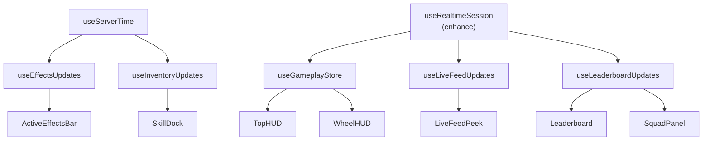

# Live Backend Integration — Quick Reference Guide

**Purpose:** Fast lookup for component-to-API mappings and implementation priorities

---

## Component Fix Priority Matrix

| Priority | Component | File Path | Effort | Blocker | Status |
|----------|-----------|-----------|--------|---------|--------|
| 🔴 1 | TopHUD | `hud/TopHUD.tsx` | 6h | None | Ready |
| 🔴 2 | WheelHUD | `hud/WheelHUD.tsx` | 6h | None | Ready |
| 🔴 3 | LiveFeedPeek | `LiveFeedPeek.tsx` | 4h | None | Ready |
| 🟠 4 | SkillDock | `SkillDock.tsx` | 5h | useInventoryStore | Ready |
| 🟠 5 | ActiveEffectsBar | `ActiveEffectsBar.tsx` | 5h | useEffectsStore | Ready |
| 🟠 6 | Leaderboard | `hud/Leaderboard.tsx` | 6h | Create new | Ready |
| 🟡 7 | SquadPanel | `SquadPanel.tsx` | 6h | Create new | Ready |
| 🟡 8 | RevivePanel | `RevivePanel.tsx` | 5h | Backend API | Ready |
| 🟢 9 | OutcomeReveal | `OutcomeReveal.tsx` | 8h | Create new | Ready |
| 🟢 10 | PhaseTransition | `PhaseTransition.tsx` | 5h | Enhance | Ready |

**Total Effort:** ~52 hours | **Recommended Duration:** 5-6 dev days

---

## Store-to-Component Mapping

### useGameplayStore

**Consumed By:**
- TopHUD (tokens, phase, phaseEndsAt)
- WheelHUD (lastOutcome, lastSpinId)
- PhaseTransition (phase, eliminated)
- RevivePanel (eliminated status)

**Must Provide:** Real-time tokens via `tokens_updated` event

---

### useLiveFeedStore

**Consumed By:**
- LiveFeedPeek (events array, max 5)

**Must Provide:** Event list populated by `livefeed:event` WebSocket events

**Hook:** `useLiveFeedUpdates(subSessionId)`

---

### useLeaderboardStore

**Consumed By:**
- TopHUD (rank lookup)
- Leaderboard (individual/squad rankings)

**Must Provide:** Sorted arrays updated via polling

**Hook:** `useLeaderboardUpdates(subSessionId)`

---

### useEffectsStore

**Consumed By:**
- ActiveEffectsBar (effects array, countdown timers)

**Must Provide:** Time-synced countdown calculations

**Hook:** `useEffectsUpdates(userId, subSessionId)`

**Dependency:** `useServerTime` (for accurate countdown)

---

### useInventoryStore

**Consumed By:**
- SkillDock (skills array, cooldown states)

**Must Provide:** Synchronized cooldown tracking

**Hook:** `useInventoryUpdates(userId, subSessionId)`

**Dependency:** `useServerTime` (for cooldown countdown)

---

## API Endpoint Reference

| Endpoint | Method | Purpose | Frequency | Priority |
|----------|--------|---------|-----------|----------|
| `/api/gameplay/leaderboard` | GET | Rankings | Poll 2s | P0 |
| `/api/player/effects` | GET | Active effects | Poll 3s | P0 |
| `/api/player/inventory` | GET | Skills & cooldowns | Poll 3s | P0 |
| `/api/server-time` | GET | Time sync | Poll 60s | P0 |
| `/api/gameplay/livefeed` | GET | Event history | Poll 2s | P0 |
| `/api/gameplay/spin` | POST | Initiate spin | Per action | P0 |
| `/api/gameplay/revive/contribute` | POST | Submit revive tokens | Per action | P1 |

---

## WebSocket Event Reference

| Event | Type | Frequency | Contains | Handler |
|-------|------|-----------|----------|---------|
| `spin_result` | Broadcast | Per spin | outcome, value, userId | setLastOutcome |
| `tokens_updated` | Broadcast | Per outcome | newTokens, change | setTokens |
| `livefeed:event` | Broadcast | Per event | type, actor, target, details | addEvent |
| `phase_change` | Broadcast | Per phase | phase, round, phaseEndsAt | setPhase |
| `effect:activated` | Unicast | Per effect | effectId, type, expiresAt | addEffect |
| `effect:expired` | Unicast | Per expiry | effectId | removeEffect |
| `leaderboard:updated` | Broadcast | Per update | rank, tokens | updateLeaderboard |
| `skill:available` | Unicast | Per cooldown | skillId | updateSkillCooldown |
| `skill:charged` | Unicast | Per charge | skillId, charges | updateSkillCharges |

---

## Data Type Contracts

### Outcome Object
```typescript
{
  type: 'ADVANCE' | 'ACQUIRE' | 'DISCOVER' | 'STEAL' | 'VOID',
  value: 3 | 1 | 0.5 | 0,
  timestamp: ISO8601,
  spinId?: string,
}
```

### LeaderboardEntry Object
```typescript
{
  rank: number,
  user_id: string,
  username: string,
  session_tokens: number,
  squad_id?: string,
  squad_name?: string,
  alive: boolean,
  position: number,
}
```

### Effect Object
```typescript
{
  id: string,
  type: 'shield' | 'cloak' | 'multiplier' | 'insurance',
  name: string,
  duration_ms: number,
  started_at: ISO8601,
  expires_at: ISO8601,
  icon: string,
}
```

### Skill Object
```typescript
{
  id: string,
  name: string,
  owned: boolean,
  available: boolean,
  cooldown_ms: number,
  cooldown_until?: ISO8601,
  charges: number,
  max_charges: number,
  icon: string,
}
```

---

## Hardcoded Values to Remove

| Pattern | Location | Replacement |
|---------|----------|-------------|
| `EVENT_POOL = [...]` | LiveFeedPeek.tsx | `useLiveFeedStore(s => s.events)` |
| `INITIAL_EFFECTS = [...]` | ActiveEffectsBar.tsx | `useEffectsStore(s => s.effects)` |
| `SKILLS = [...]` | SkillDock.tsx | `useInventoryStore(s => s.skills)` |
| `tokens \|\| 24.5` | TopHUD.tsx | `useGameplayStore(s => s.tokens)` |
| `playerRank \|\| 7` | TopHUD.tsx | `getPlayerRank(leaderboard)` |
| `totalPlayers \|\| 28` | TopHUD.tsx | `leaderboard.length` |
| `surgePercent = 45` | TopHUD.tsx | Backend broadcast value |

---

## Hook Implementation Order



---

## Testing Priority (By Component)

| Component | Test Type | Min Coverage | Status |
|-----------|-----------|--------------|--------|
| TopHUD | Unit + Manual | Timer accuracy | Ready |
| WheelHUD | Unit + E2E | Spin cycle | Ready |
| LiveFeedPeek | Unit | Event ordering | Ready |
| SkillDock | Unit + Manual | Cooldown timing | Ready |
| Leaderboard | Unit + Manual | Real-time updates | Ready |
| ActiveEffectsBar | Unit + Manual | Countdown accuracy | Ready |

**E2E Scenarios:** 4 critical paths (see section 6)

---

## Deployment Checklist

**Pre-Deployment (Day 5):**
- [ ] All hardcoded values removed (grep verification)
- [ ] All hooks tested individually
- [ ] Integration tests passing
- [ ] Performance benchmarks met
- [ ] Mobile responsive verified
- [ ] Offline handling tested

**Deployment Day:**
- [ ] Staging environment verified
- [ ] Canary rollout (10% users)
- [ ] Monitor error rates
- [ ] Gradual ramp to 100%
- [ ] Production incident response ready

**Post-Deployment (24h):**
- [ ] Error rate < 0.1%
- [ ] No rollback necessary
- [ ] User feedback collected
- [ ] Performance metrics normal

---

## Common Pitfalls & Prevention

| Pitfall | Prevention | Verification |
|---------|-----------|--------------|
| Fallback values displayed | Remove all `\|\|` and `\?\?` | Grep search |
| Hardcoded arrays used | Delete constants | Code review |
| Network requests not debounced | Implement polling intervals | Network tab |
| Animations skip/stutter | Test 60 FPS requirement | DevTools Performance |
| Reconnection loops | Exponential backoff + max attempts | Network tests |
| State desynchronization | Always validate server data | Unit tests |
| Memory leaks | Unsubscribe on unmount | Heap snapshot |

---

## Emergency Rollback (If Needed)

1. **Immediate:** Revert to previous component version
2. **Data:** Restore previous store state (5-min cache)
3. **Users:** Show "Maintenance" banner
4. **Investigation:** Check error logs in staging
5. **Fix:** Deploy patched version
6. **Verification:** Run integration tests
7. **Re-deploy:** Canary rollout

**Rollback SLA:** < 5 minutes

---

